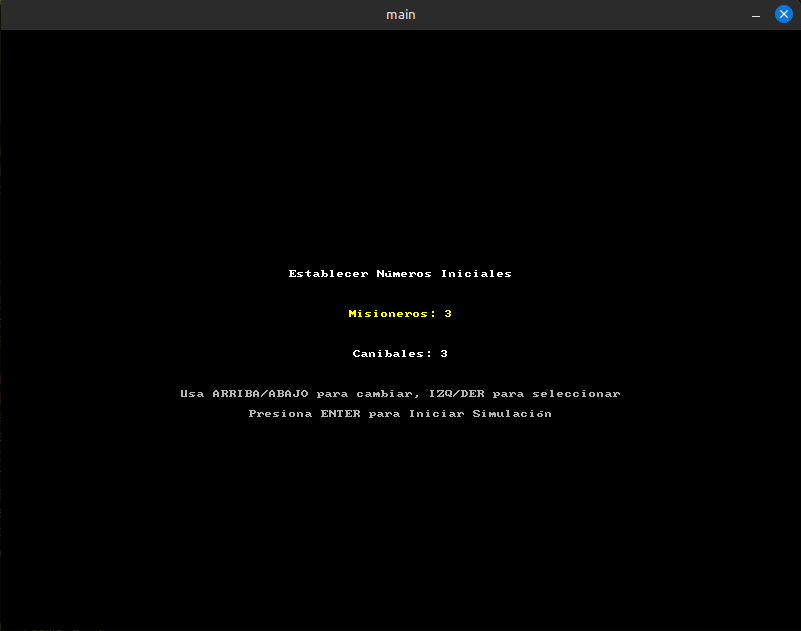
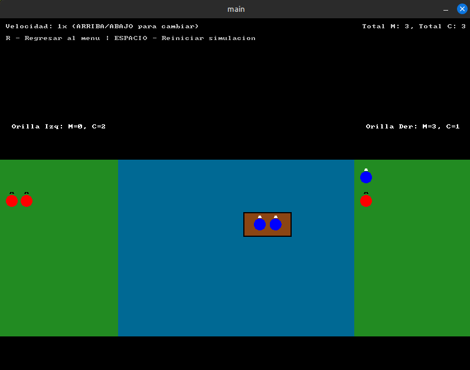
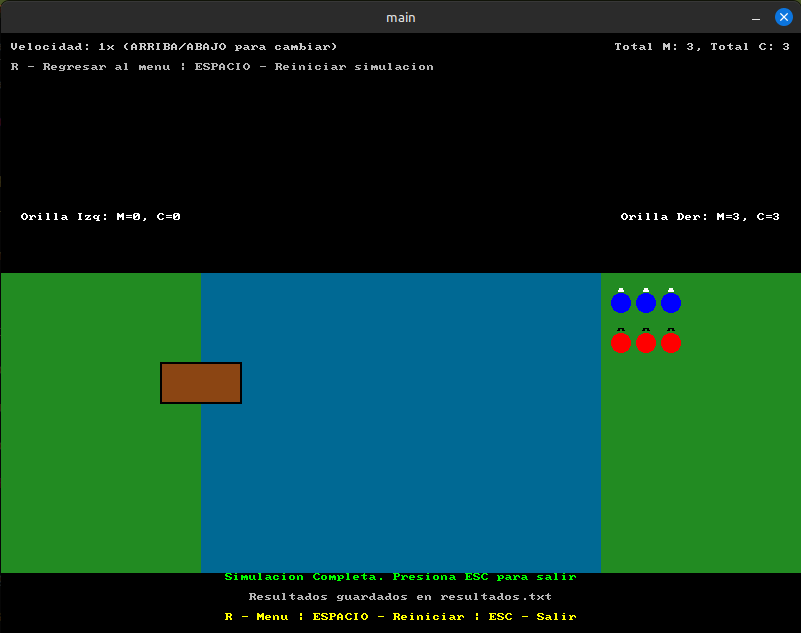

# Simulación del Problema de Misioneros y Caníbales

## Imágenes de la Simulación

A continuación se muestran capturas de pantalla representativas de la simulación:

### Menú Principal


### Resolución del Problema


### Pantalla Final


Este proyecto es una simulación gráfica del clásico problema de lógica de los Misioneros y Caníbales, implementado en C++ utilizando la biblioteca Allegro 5. El programa permite al usuario definir el número inicial de misioneros y caníbales, y luego visualiza la solución paso a paso, si existe.

## Características

*   **Resolución del Problema:** Implementa un algoritmo de búsqueda (DFS) para encontrar una solución al problema de Misioneros y Caníbales.
*   **Visualización Gráfica:** Utiliza Allegro 5 para dibujar el estado del problema, incluyendo las orillas del río, el bote, y las figuras de los misioneros y caníbales.
*   **Animación de la Solución:** Muestra la secuencia de movimientos de la solución encontrada de forma animada.
*   **Entrada de Usuario:** Permite al usuario especificar el número inicial de misioneros y caníbales.
*   **Control de Velocidad:** El usuario puede ajustar la velocidad de la animación de la solución.
*   **Detección de Estados Inválidos:** Verifica la validez de los estados para asegurar que los misioneros no sean superados en número por los caníbales en ninguna orilla.
*   **Generación de Archivo de Resultados:** Cuando se encuentra una solución, se genera automáticamente un archivo `resultados.txt` con la secuencia completa de pasos.
*   **Controles de Navegación:** Incluye opciones para regresar al menú principal y reiniciar la simulación sin necesidad de cargar archivos.
*   **Interfaz Interactiva:** Guía al usuario a través de diferentes fases: entrada de datos, resolución/animación, y estado final (solución encontrada o sin solución).

## Requisitos

*   Un compilador de C++ (como g++)
*   Allegro 5 

Asegúrate de tener Allegro 5 instalado en tu sistema.

**Para Ubuntu 18.04+ (o derivados):**

Primero, añade el PPA de Allegro. Esto te dará versiones actualizadas de Allegro:
```bash
sudo add-apt-repository ppa:allegro/5.2
sudo apt-get update
```
Luego, instala Allegro y los addons necesarios:
```bash
sudo apt-get install liballegro*5.2 liballegro*5-dev
```

**Para Windows:**

Existen varias formas de obtener los binarios de Allegro para Windows:
*   **Nuget:** El paquete de Allegro en Nuget contiene los binarios oficiales en un formato fácil de usar con MSVC.
*   **Allegro 5.2 binary packages:** Las releases de Allegro en GitHub también vienen con varias distribuciones binarias de Allegro para Windows.
*   **Allegro 5 dependencies:** El proyecto `allegro_winpkg` en GitHub tiene releases que vienen con las dependencias de Allegro precompiladas para Windows.

Consulta el [wiki tutorial de Allegro](https://liballeg.org/download.html#windows) para instrucciones detalladas de instalación en Windows.

Para otras distribuciones o sistemas operativos, consulta la [documentación oficial de Allegro](https://liballeg.org/download.html).

## Compilación y Ejecución

El proyecto incluye tareas de VS Code para facilitar la compilación y ejecución. Si no usas VS Code, puedes compilar el archivo `main.cpp` manualmente desde la terminal.

**Usando las tareas de VS Code:**

1.  Abre el proyecto en VS Code.
2.  Abre `main.cpp`.
3.  Presiona `Ctrl+Shift+B` (o `Cmd+Shift+B` en macOS).
4.  Selecciona la tarea:
    *   `Compile Active Allegro File`: Solo compila el archivo.
    *   `Compile and Run Active Allegro File`: Compila y luego ejecuta la simulación.

**Manualmente desde la terminal (Linux):**

Navega al directorio del proyecto y ejecuta el siguiente comando para compilar:
```bash
g++ main.cpp -o misioneros_canibales -std=c++11 `pkg-config --cflags allegro-5 allegro_font-5 allegro_primitives-5` `pkg-config --libs allegro-5 allegro_font-5 allegro_primitives-5`
```
Luego, para ejecutar la simulación:
```bash
./misioneros_canibales
```

## Cómo Jugar

1.  **Establecer Números Iniciales:**
    *   Al iniciar, estarás en la pantalla de configuración.
    *   Usa las teclas de **FLECHA ARRIBA** y **FLECHA ABAJO** para aumentar o disminuir el número de misioneros o caníbales seleccionados.
    *   Usa las teclas de **FLECHA IZQUIERDA** y **FLECHA DERECHA** para cambiar entre la selección de misioneros y caníbales.
    *   Presiona **ENTER** para iniciar la simulación con los números establecidos.

2.  **Visualización de la Solución:**
    *   Si se encuentra una solución, la animación comenzará a mostrar los pasos.
    *   Usa la **FLECHA ARRIBA** para aumentar la velocidad de la simulación (máximo 10x).
    *   Usa la **FLECHA ABAJO** para disminuir la velocidad de la simulación (mínimo 0.5x).
    *   Presiona **R** para regresar al menú principal en cualquier momento.
    *   Presiona **ESPACIO** para reiniciar la simulación con los mismos valores iniciales.

3.  **Fin de la Simulación:**
    *   Si se encuentra una solución, se mostrará el mensaje "SOLUCION ENCONTRADA!" y "Simulacion Completa".
    *   Los resultados se guardan automáticamente en un archivo `resultados.txt` en el directorio del proyecto.
    *   Si no se encuentra una solución para los valores dados, se mostrará "NO SE ENCONTRO SOLUCION para estos valores."
    *   Presiona **ESC** en cualquier momento para salir del programa.
    *   Presiona **R** para regresar al menú principal y probar otros valores.

## Archivo de Resultados

Cuando se encuentra una solución exitosa, el programa genera automáticamente un archivo `resultados.txt` que contiene:
*   Los parámetros del problema (número de misioneros y caníbales iniciales)
*   La capacidad del bote
*   Una secuencia detallada de todos los pasos de la solución

**Ejemplo de contenido del archivo:**
```
Solución para Misioneros: 3, Caníbales: 3
Capacidad del bote: 2
------------------------------------------
Paso 0: Izq(M:3, C:3) Der(M:0, C:0) Bote:Izquierda
Paso 1: Izq(M:3, C:1) Der(M:0, C:2) Bote:Derecha
Paso 2: Izq(M:3, C:2) Der(M:0, C:1) Bote:Izquierda
...
```